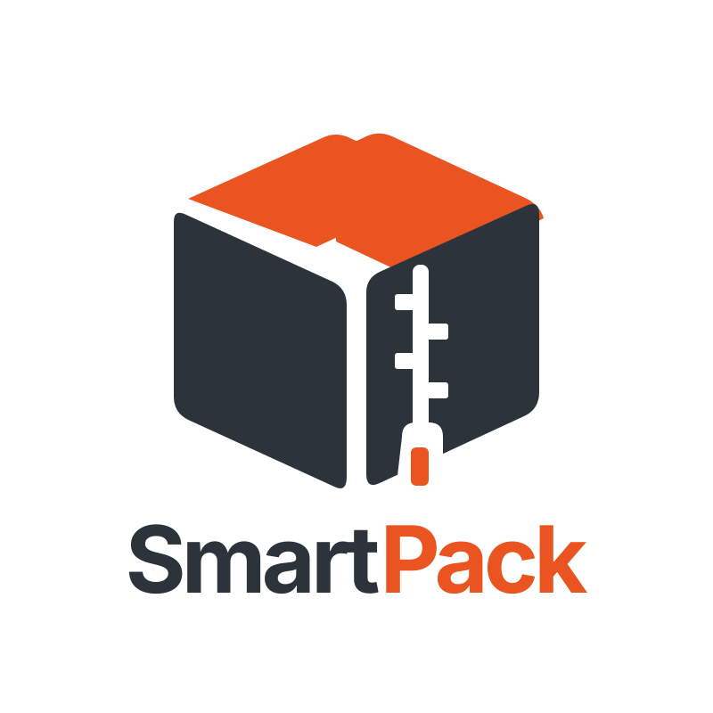

<p align="center">
  
</p>

<h1 align="center">SmartPack</h1>

<p align="center"><strong>Private, cross-platform archiving with a shared Rust core.</strong></p>

<p align="center">A local-first archive manager for Windows, macOS, and Linux, with a desktop app, CLI, adaptive compression, encryption, verification, and recovery workflows.</p>

<p align="center"><a href="https://github.com/tahamoeini/smartpack/releases" target="_blank" rel="noopener noreferrer">View SmartPack downloads</a></p>

<p align="center">
  <a href="https://www.producthunt.com/products/smartpack?embed=true&amp;utm_source=badge-featured&amp;utm_medium=badge&amp;utm_campaign=badge-smartpack" target="_blank" rel="noopener noreferrer">
    <picture>
      <source media="(prefers-color-scheme: dark)" srcset="https://api.producthunt.com/widgets/embed-image/v1/featured.svg?post_id=1247021&amp;theme=dark&amp;t=1789071163896">
      <source media="(prefers-color-scheme: light)" srcset="https://api.producthunt.com/widgets/embed-image/v1/featured.svg?post_id=1247021&amp;theme=light&amp;t=1789071152289">
      
    </picture>
  </a>
</p>

> **Current beta:** `v0.3.0-beta.1` is an evaluation release. GitHub Actions builds Windows x64, Ubuntu 22.04+ x64, and Intel/Apple-silicon macOS packages. Installers are unsigned and macOS builds are not notarized. Use copies of important data while evaluating the beta. See [GitHub Releases](https://github.com/tahamoeini/smartpack/releases) for availability.

SmartPack does not claim to beat every archive tool on every dataset. Compression results depend on input, codec, CPU, filesystem, and settings. Comparative claims belong in reproducible, workload-specific benchmarks using the current engine.

## What SmartPack does today

- Creates **SPK v3** archives with content-defined chunking, SHA-256 integrity checks, duplicate-block reuse, zero-chunk representation, streaming input, and bounded per-chunk buffers.
- Reads and verifies legacy **SPK v2** archives created by the earlier Python implementation.
- Provides Fast and Balanced profiles using Zstandard, Smallest using LZMA2/XZ, and Store for uncompressed storage. Already-compressed signatures and unhelpful compression results fall back to raw storage.
- Supports optional **SPK encryption** using Argon2id and XChaCha20-Poly1305. Names and metadata are stored in the encrypted manifest, and passwords are not written to logs or configuration.
- Creates ZIP archives and safely reads supported external formats through a bundled pure-Rust archive implementation, including ZIP, 7z, TAR, and enabled gzip, xz, Zstandard, and lz4 filters.
- Uses capability-rooted safe extraction. Traversal and absolute paths are rejected, links and special files are disabled by default, and existing destination entries are not overwritten.
- Includes a Tauri 2 desktop interface for Windows, macOS, and Linux with create, open, extract, verify, recent jobs, drag-and-drop, progress, cancellation, and compression profiles.
- Exposes the same archive engine through a CLI:

  ```text
  smartpack create <source> <archive.spk|archive.zip> [--profile fast|balanced|smallest|store] [--encrypt]
  smartpack list <archive.spk>
  smartpack verify <archive>
  smartpack extract <archive> <destination>
  smartpack recover create <archive> <output-directory> [recovery-percent]
  smartpack repair <index.par2> <source-directory> <repaired-output-directory>
  ```

## Compatibility and current boundaries

SmartPack is not yet a drop-in replacement for every mature archive suite. PAR2 creation and repair have CLI, GUI, and shared-engine entry points, but still need end-to-end damaged-file fixtures and cross-tool validation. RAR reading, standalone bzip2-filter extraction, WinZip AES creation, SPK volume splitting, and full timestamp/permissions/link/sparse restoration are not implemented. Signed installers and broad platform smoke testing remain stable-release work.

See the [release validation matrix](docs/release-matrix.md) and [benchmark comparison](docs/benchmarks.md) for exact coverage and remaining release gates.

## Build the engine and CLI

Rust 1.89 or newer is required by the selected codec and archive crates.

```powershell
cargo test --manifest-path rust_crates/Cargo.toml --locked
cargo run --manifest-path rust_crates/Cargo.toml -- create .\input .\backup.spk --profile balanced
cargo run --manifest-path rust_crates/Cargo.toml -- verify .\backup.spk
cargo run --manifest-path rust_crates/Cargo.toml -- extract .\backup.spk .\restored
```

To create an encrypted SPK, add `--encrypt`; the CLI prompts without echoing the password. ZIP names remain visible by design.

## Build the desktop app

Follow [Tauri's platform prerequisites](https://v2.tauri.app/start/prerequisites/) for Windows, macOS, or Linux, and install Node.js 22. For development:

```sh
cd desktop
npm ci
npm run tauri dev
```

Before a local production bundle, run `npm ci`, then from the repository root run `cargo fetch --locked --manifest-path desktop/src-tauri/Cargo.toml` and `python tools/generate_third_party_notices.py --output desktop/src-tauri/resources/THIRD_PARTY_NOTICES.md`. Then run `npm run tauri build` from `desktop`. The tag-triggered workflow performs these steps on native GitHub-hosted runners.

## Benchmarks and tool comparison

The deterministic benchmark suite compares SmartPack with tar+gzip and 7-Zip on text, incompressible, many-small-file, and duplicate-file workloads. It verifies extracted hashes and publishes JSON/CSV results with each CI run. WinRAR/RAR and WinZip can also be measured locally when their command-line tools are installed; CI does not install commercial archivers. See [benchmark instructions and comparison](docs/benchmarks.md).

## Product Hunt copy

The current public positioning and the exact Product Hunt fields that match the v0.3 implementation are maintained in [docs/product-hunt.md](docs/product-hunt.md). Historical Python-only claims and early benchmark numbers should not be reused for the current Rust-based product unless reproduced against the current engine.

## Repository layout

- `rust_crates/`: shared archive engine, CLI, and engine tests.
- `desktop/`: React/TypeScript UI and Tauri 2 host.
- `docs/`: SPK format notes, release validation, benchmark protocol, and public product copy.
- `smartpack_ubuntu.py`, `smartpack_python_lite.py`, `smartpack_python_native.py`, `smartpack_rust_native.rs`: historical prototypes retained for compatibility/reference; new development should use the Rust engine.

## License

SmartPack is distributed under the Apache License 2.0; see [LICENSE](LICENSE). Third-party dependency notices are bundled in each beta installer.
